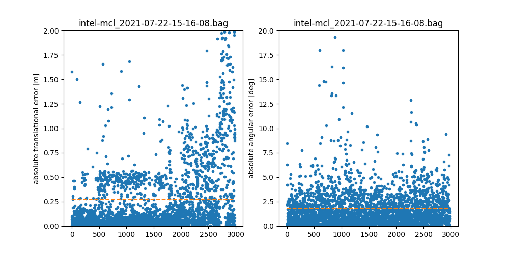

# Benchmark

To compare localization algorithms, we need ground truth data. This is quite hard to capture. Luckily the University of
Freiburg has several datasets with manually corrected relative relations.

## 1. Obtain a dataset

First obtain a dataset from http://ais.informatik.uni-freiburg.de/slamevaluation/datasets.php

```sh
wget http://ais.informatik.uni-freiburg.de/slamevaluation/datasets/intel.clf
wget http://ais.informatik.uni-freiburg.de/slamevaluation/datasets/intel.relations
```

Install these dependencies:
```
sudo apt install -y ros-$ROS_DISTRO-iris-lama-ros
ros-get install carmen_publisher
```

Run a fresh roscore (no `use_sim_time=true`)

```
roscore
```

Convert the carmen files to rosbag
with [carmen_publisher](https://github.com/ruvu/carmen_publisher/tree/feature/python3)

```sh
rosrun carmen_publisher carmen2rosbag.py -i intel.clf -o intel.bag _FLASER_topic:=/scan _ODOM_topic:=/odom
```

Then we need to SLAM a map:

```sh
rosparam set /pf_slam2d_ros/resolution 0.025
roslaunch iris_lama_ros pf_slam2d_offine.launch rosbag:=$PWD/intel.bag
```

And then in another terminal save the map

```sh
rosrun map_server map_saver -f intel
```

Now let's add the map to the bagfile

```sh
rosrun ruvu_mcl add_map_to_rosbag intel.bag intel.yaml
```

If everything went OK, you should now have a bagfile with at least a /map, /tf and /scan topic.

```
rosbag info intel.bag 
...
topics:      /map        1 msg     : nav_msgs/OccupancyGrid
             /odom   26915 msgs    : nav_msgs/Odometry     
             /scan   13631 msgs    : sensor_msgs/LaserScan 
             /tf     26915 msgs    : tf2_msgs/TFMessage

```

## 2. Comparing a run of MCL with the manually obtained relations

```sh
rosbag record -o intel-mcl /tf
rosrun ruvu_mcl offline intel.bag _transform_tolerance:=0
```

And plot the results

```sh
rosrun ruvu_mcl plot_benchmark_results intel.relations intel-mcl_* 
```

Example output:

```
intel-mcl_2021-07-22-15-16-08.bag translation_err=0.27223234572953725 rotation_err=1.8116275303694251
```


