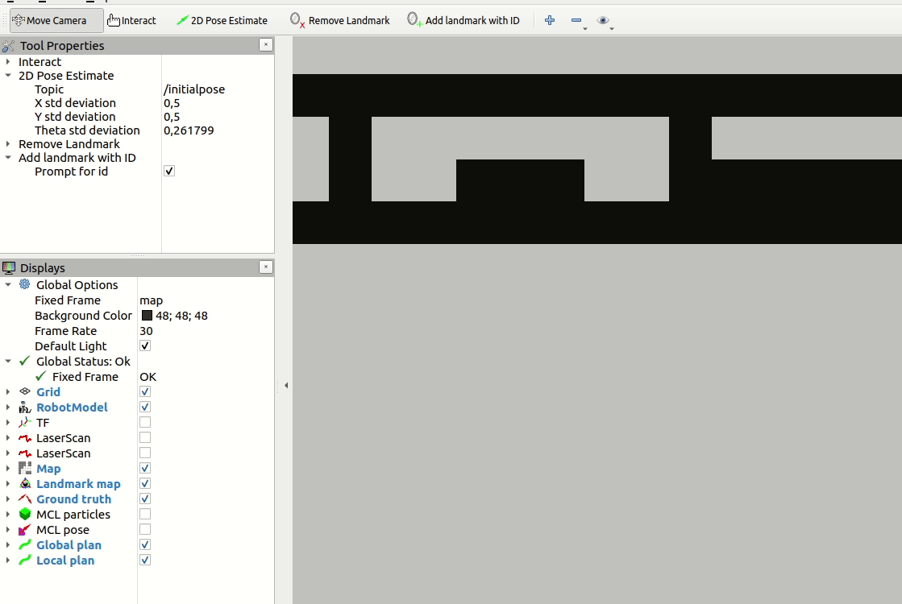

# RUVU MCL RViz plugins
This package provides rviz plugins for visualizing and interacting with parts of the RUVU MCL system.

## Add landmark tool
The `add_landmark` tool provides an RViz tool plugin for adding landmarks to the landmark server. Through the tool properties, the user can toggle between adding landmarks with ID (which will prompt the user for an ID) or adding landmarks without ID, omitting the ID prompt.

### Services

This plugin calls the service `/add_landmark [ruvu_mcl_msgs/AddLandmark]` which is served by the Landmark Server.
